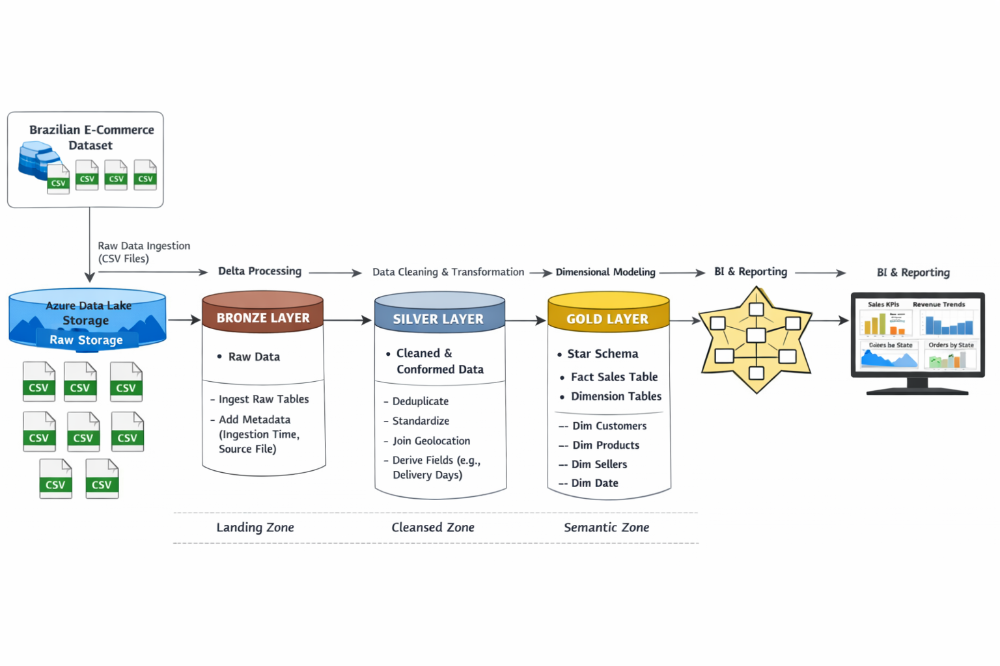

# olist-ecommerce-lakehouse
Designed and implemented an end-to-end Lakehouse solution using the Brazilian Olist E-Commerce dataset. Applied Medallion Architecture (Bronze, Silver, Gold) in Databricks with Delta Lake, transforming raw data into a dimensional star schema optimized for analytics and Power BI reporting.

## Project Architecture
